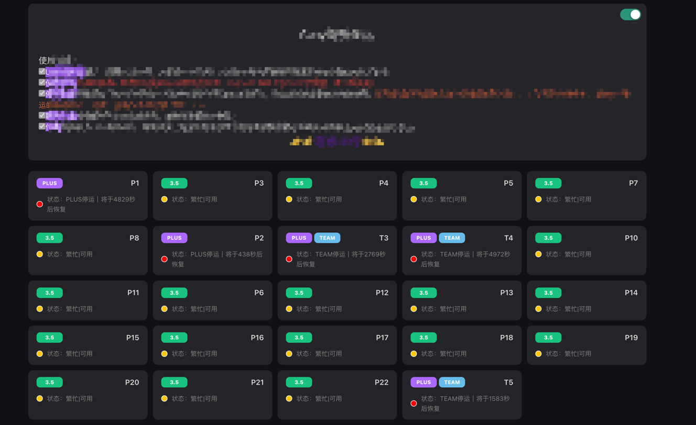

## 基于Naiveui制作的ChatGPT-share 前端界面

无需编译，在 "chatgpt-share" 目录下执行以下脚本即可，源码已开源可随意更改。

默认加载48条数据，下拉滚动加载，/src/components/index.vue 第45行可自行更改加载条数。

提示：执行过后list目录下都会删除，请做好备份，docker有无映射目录都不影响。

## Update
- 2024-01-22 更新横排五个，避免显示时长的时候穿模；
- 2024-03-26 增`加Team 账号显示，车队名称带T的就会`显示；
- 2024-03-27 增加主题切换功能,增加上拉加载功能；
- 2024-03-28 更改默认主题为Dark、增加Dark图标、增加页签切换自动车辆刷新状态、增加上拉加载更多提醒；
- 2024-04-12 解决车数量超过50上拉不加载的bug
- 2024-04-15 删除"繁忙" "推荐"关键词


## 一键快速替换前端页面：
```shell
curl -sSfL https://raw.githubusercontent.com/frontend-winter/sharelist/master/quick-install/quick-list.sh | bash
```




## 公告配置
在管理后台-系统设置-参数配置-参数列表中新增参数notice，值为公告内容，支持 html 标签


### 使用前端框架
```html
https://www.naiveui.com/
```
### 编译项目
```sh
npm install
```

### 运行项目

```sh
npm run dev
```

### 项目打包

```sh
npm run build
```
